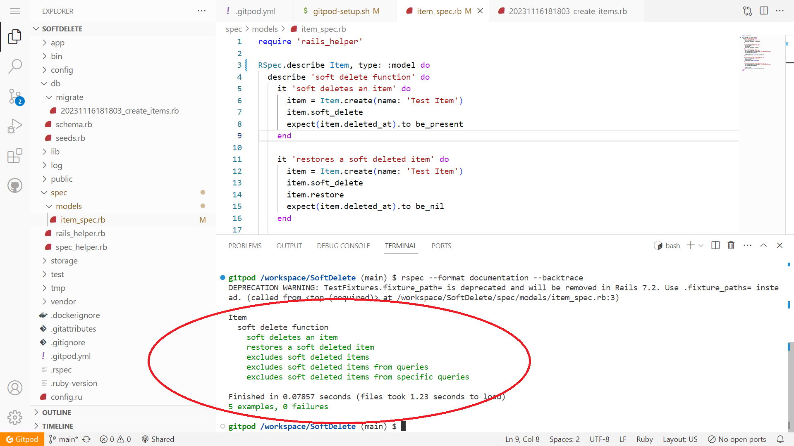

# Rails Soft Delete

GitPod Link:

https://gitpod.io/start/#cli3338198-softdelete-r7duhq6hjzt



Scenario:

You are tasked with implementing a basic soft delete functionality for a Ruby on Rails model named Item. Soft deletes involve marking records as "deleted" without physically removing them from the database. This is commonly used to implement features such as a trash/recycle bin.

Model Creation & Soft Delete Implementation:

```bash
rails generate model Item name:string deleted_at:datetime
```

[Code](./app/models/item.rb)

```rb
class Item < ApplicationRecord

# Soft delete method
def soft_delete
  update(deleted_at: Time.current)
end

# Restore method
def restore
  update(deleted_at: nil)
end

# Default scope to exclude "deleted" items
default_scope { where(deleted_at: nil) }

end
```

Testing:

[Code](./spec/models/item_spec.rb)

```rb
RSpec.describe Item, type: :model do
  describe 'soft delete function' do
    it 'soft deletes an item' do
      item = Item.create(name: 'Test Item')
      item.soft_delete
      expect(item.deleted_at).to be_present
      expect(Item.count).to eq(0)
    end

    it 'restores a soft deleted item' do
      item = Item.create(name: 'Test Item')
      item.soft_delete
      item.restore
      expect(item.deleted_at).to be_nil
    end

    it 'excludes soft deleted items' do
      item = Item.create(name: 'Test item')
      soft_deleted_item = Item.create(name: 'Soft Deleted Test Item')
      expect(Item.count).to eq(2)
      soft_deleted_item.soft_delete

      items = Item.all
      expect(items).not_to include(soft_deleted_item)
      expect(Item.count).to eq(1)
    end

    it 'excludes soft deleted items from queries' do
      item = Item.create(name: 'Test item')
      item.soft_delete
      items = Item.all
      expect(items).not_to include(item)
    end

    it 'excludes soft deleted items from specific queries' do
      item = Item.create(name: 'Test item')
      soft_deleted_item = Item.create(name: 'Soft Deleted Test Item')
      soft_deleted_item.soft_delete

      items = Item.all
      expect(items).not_to include(soft_deleted_item)
    end
  end
end
```

## Running Locally

1. Clone repo

```bash
git clone https://github.com/cli3338198/SoftDelete.git
```

2. Install Dependencies

```bash
bundle install
```

3. Setup

```bash
rails db:create
```

```bash
rails db:migrate
```

4. Run Rspec

```bash
rspec
```

## Running on GitPod

Sign in to GitPod and use the following shared workspace:
https://gitpod.io/start/#cli3338198-softdelete-r7duhq6hjzt

1. Check Permissions

```bash
ls -l ./gitpod-setup.sh
```

```bash
chmod +x ./gitpod-setup.sh
```

2. Setup Gitpod

```bash
bash ./gitpod-setup.sh
```

3. Install Dependencies

```bash
bundle install
```

4. Setup Rails

```bash
rails db:create
```

```bash
rails db:migrate
```

5. Run Rspec

```bash
rspec
```
